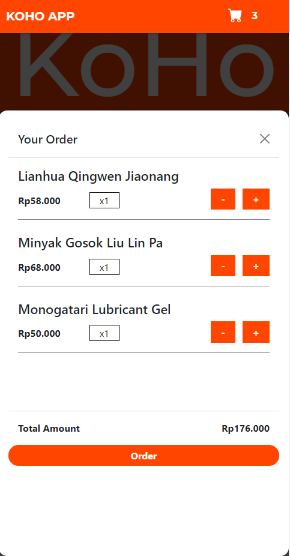
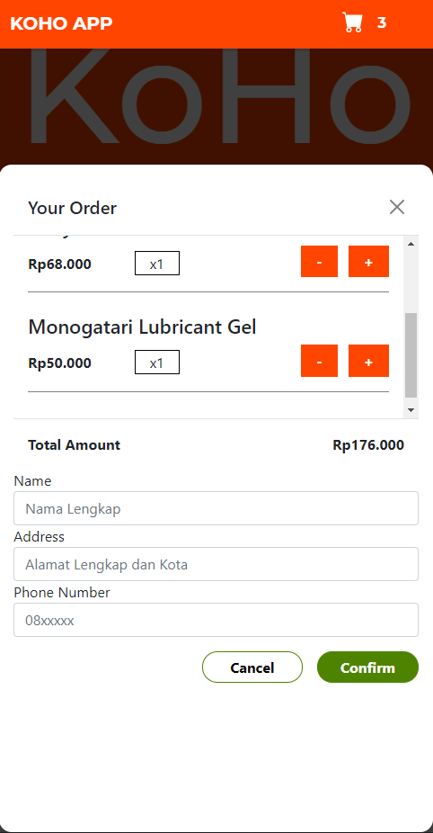

# Overview

My first ReactJs project. It is a simple ecommerece website based on my friend tokopedia products. The website is built with MOBILE-FIRST.

### Features

- Responsive webdesign
- Single Page Applicatio
- "Cart" Feature with Modal
- Form Validation
- Order and Confirm connected to Whatsaapp with go-to-order template for buying products
- Products is stored in firebase

### Screenshot





## My Process

### Built with

- ReactJs (Component Based, State Management, React Hooks)
- CSS3
- Bootstrap 5
- React Icons
- Firebase

### What I Learned

Passing down props sometimes can be confusing and mess, fixed it with useContext for global state management and it runs pretty well.

The logic for adding and decreasing one product itself is kinda challenging this is what i got from my code in CartReducer.js file using useReducer dispatch action.

```
if (action.type === "ADD") {
    const newTotalAmount =
      state.totalAmount + action.item.price * action.item.amount;

    const existingCartItemIndex = state.items.findIndex(
      (item) => item.id === action.item.id
    );
    const existingCartItem = state.items[existingCartItemIndex];
    let updatedItem;
    let updatedItems;

    if (existingCartItem) {
      updatedItem = {
        ...existingCartItem,
        amount: existingCartItem.amount + action.item.amount,
      };
      updatedItems = [...state.items];
      updatedItems[existingCartItemIndex] = updatedItem;
    } else {
      updatedItem = { ...action.item };
      updatedItems = state.items.concat(updatedItem);
    }

    return {
      items: updatedItems,
      totalAmount: newTotalAmount,
    };
  }

  if (action.type === "REMOVE") {
    let updatedItems;
    const index = state.items.findIndex((item) => item.id === action.id);

    if (state.items[index].amount === 1) {
      updatedItems = state.items.filter((item) => item.id !== action.id);
    } else {
      updatedItems = [...state.items];
      updatedItems[index].amount -= 1;
    }
    return {
      items: updatedItems,
      totalAmount: state.totalAmount - state.items[index].price,
    };
  }
```

### Continued Development

Still learning React and looking to learn more about Redux and React Router. We'll see!

## Author

-althafdaa
